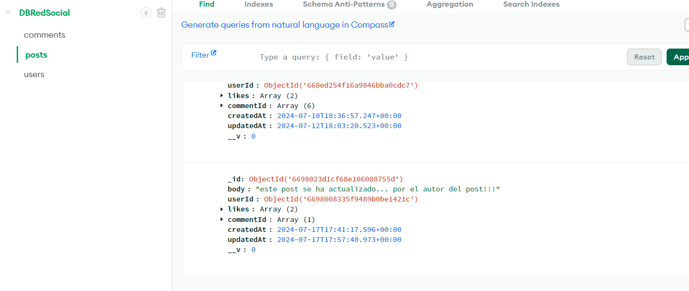
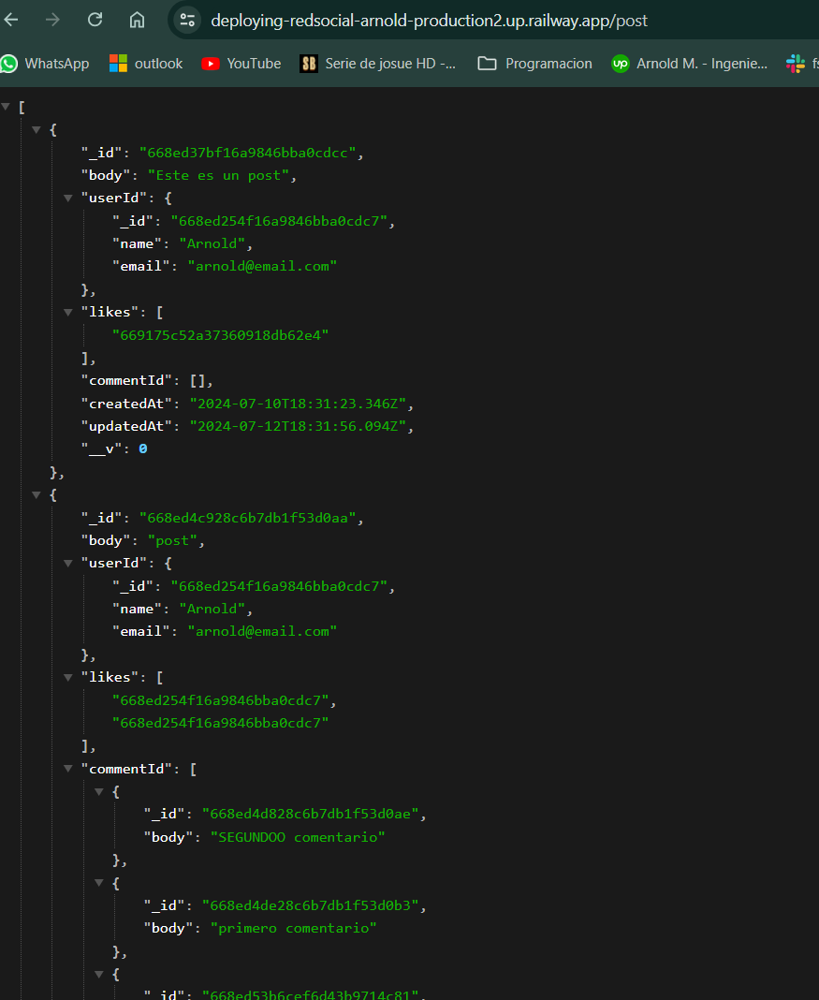
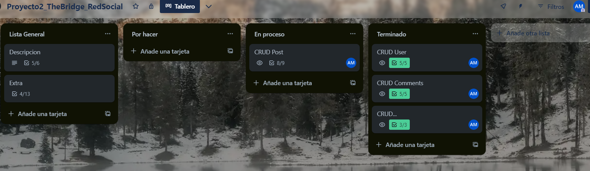
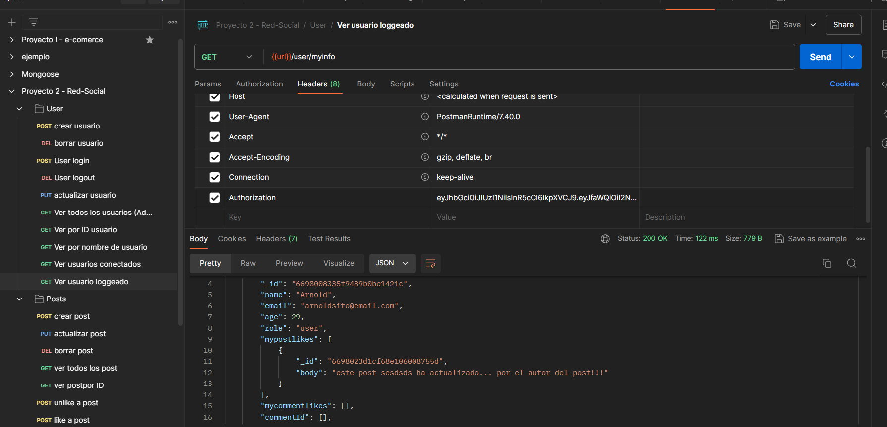

# RedSocial

2do proyecto en Bootcamp Fullstack en TheBridge

## Descripción ⚙️

Base de datos para una Red Social en donde se han implementado diferentes herramientas para la elaboracion, control y seguridad de la misma

## Visuales

Estas son algunas imagenes de ejemplo de como se ve la base de datos





## Empezando 🚀

Estas instrucciones te guiarán para obtener una copia de este proyecto en funcionamiento en tu máquina local para propósitos de desarrollo y pruebas.

### Prerrequisitos 📋

Lista de software y herramientas, incluyendo versiones, que necesitas para instalar y ejecutar este proyecto:

- "bcryptjs": "^2.4.3",
- "dotenv": "^16.4.5",
- "express": "^4.19.2",
- "jsonwebtoken": "^9.0.2",
- "mongoose": "^8.4.5"
- "nodemon": "^3.1.4"
- Javascript
- VisualStudio

### Instalación 🔧

*Una vez descargado el repositorio, realizar una instalacion de NPM para que descargue todas las dependencias mencionadas en el archivo JSON
*Ejecutar el programa en un puerto definido para obtener respuesta en local en el servidor

```bash
# paso 1
npm install
```

```bash
# paso 2 (para ejecutar como developer)
npm run dev
```

## Ejecutando los ejemplos ⚙️

Ingresar en postman y utilizar las rutas necesarias para cada caso.

## Construido Con 🛠️

- [Javascript](https://developer.mozilla.org/es/docs/Web/JavaScript)
- [Express](https://expressjs.com/)
- [Node.js](https://nodejs.org/en)

## Soporte

Si tienes algún problema o sugerencia, por favor abre un problema [aquí](https://github.com/arnoldm94/RedSocial/issues).

## Roadmap

Seguiremos implementando mejoras en lo que va de curso para optimizar el proceso y sacar mas provecho de las herramientas

## Autores ✒️

- **Arnold Melet** - _Trabajo inicial_ - [Arnoldm94](https://github.com/arnoldm94)

Mira también la lista de [contribuidores](https://github.com/arnoldm94/e-comerce/contributors) que han participado en este proyecto.

## Expresiones de Gratitud 🎁

Estamos agradecidos por las contribuciones de instructores de TheBridge a este proyecto. Si encontraste cualquier valor en este proyecto o quieres contribuir, aquí está lo que puedes hacer:

- Comparte este proyecto con otros
- Invítanos un café ☕
- Inicia un nuevo problema o contribuye con un PR
- Muestra tu agradecimiento diciendo gracias en un nuevo problema.

---
